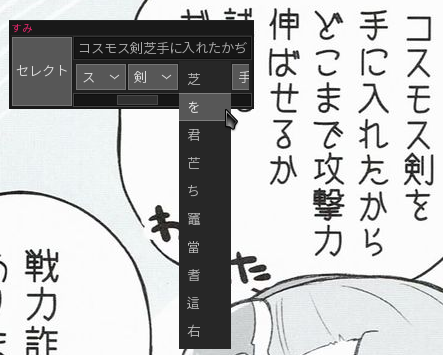
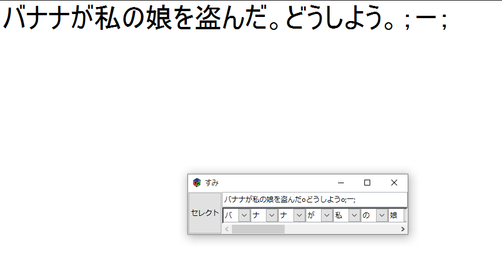

sumi
====

`Sumi` is a simple OCR application with support for corrections.

Screenshots
-----------

Requirements
------------

 * Go
 * GTK+ 3.16 or later
 * [Tesseract][0] 3.04.00 or later
 * Trained data for your language
 * One of the following:
   * X11
     * [maim][1] + [slop][2]
     * scrot
     * GraphicsMagick 
     * ImageMagick
   * Windows
     * [boxcutter][3]

If none of the screenshot utilities above are available on your system, you can
use the `SUMI_SCREENCAPTURE` environment variable to provide your own. The
utility is expected to select a part of the screen and write to the file path
specified in the last argument, e.g. for `scrot` the valid `SUMI_SCREENCAPTURE`
value would be `scrot -s`.

[0]: https://github.com/tesseract-ocr/tesseract
[1]: https://github.com/naelstrof/maim
[2]: https://github.com/naelstrof/slop
[3]: https://github.com/mdrasmus/boxcutter

How to install
--------------

 1. Download and install all dependencies from the list above
 2. `go get github.com/tsudoko/sumi`

Selecting a language
--------------------

To use a language other than Japanese (or more than one language at once), pass
the ISO 639-3 code of the desired language in a `-l` flag, i.e. `sumi -l eng`.
Please note though that `sumi` was designed to work specifically with Japanese,
therefore it might give worse results when used with other languages.

Using external software with `sumi`
-----------------------------------

`Sumi` prints scanned text to `stdout`. It's possible to send it to other
programs automatically, examples below.

### Auto copy to clipboard

X11, requires `xclip`.

    ./sumi | while read -r a; do echo "$a" | xclip -i -sel clip; done

Windows, requires a `sh`-compatible shell and `iconv`. You have to replace `$cp`
with your locale's codepage, for Japanese it's `cp932`.

    ./sumi.exe | while read -r a; do echo "$a" | iconv -t $cp | clip; done

### Auto dictionary lookup

With [ep](https://github.com/cyndis/ep):

    ./sumi | xargs -n1 ep

With [myougiden](https://github.com/leoboiko/myougiden):

    ./sumi | xargs -n1 myougiden

Similar software
----------------

 * [tsuntsun](https://github.com/Fuuzetsu/tsuntsun)
 * [Capture2Text](http://capture2text.sourceforge.net/)
 * [KanjiTomo](http://kanjitomo.net/)
